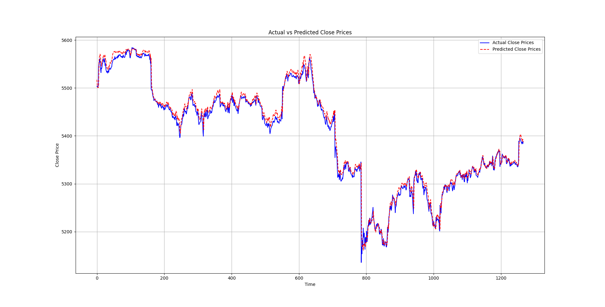
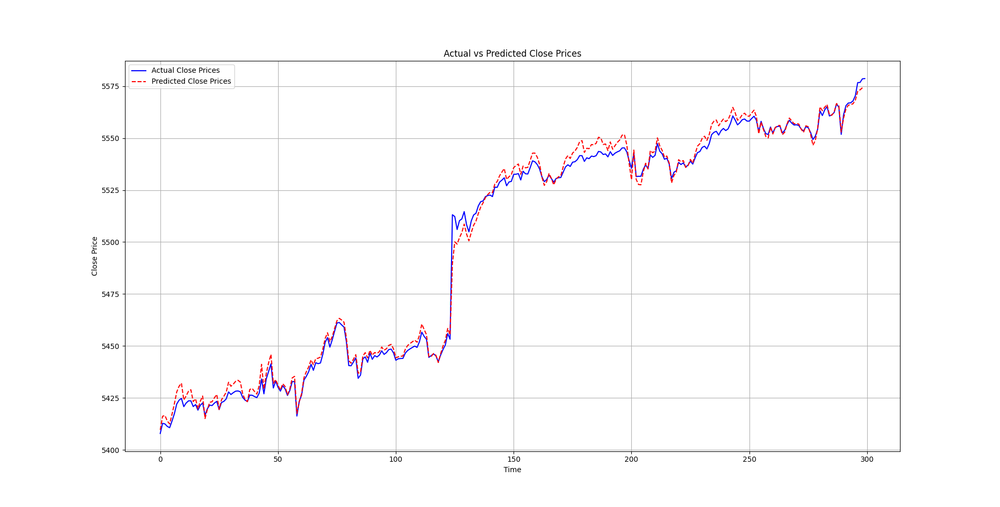

    

  
  
  

---

**S&P 500 Price-Prediction-Models**, Gathers machine learning and deep learning models for Stock forecasting.

## Table of contents
  * [Models](#models)
  * [Results](#results)

## Contents

### Models

 1. LSTM
 2. GRU
 3. CNN-Seq2seq
 4. Transformer

## Results

I will cut the dataset to training and testing datasets,

The training dataset comprises 80% of the entire dataset, while the testing dataset consists of the remaining 20%.

1.This diagram illustrates the actual prices and predicted prices within the training dataset.

2.This diagram illustrates the actual prices and predicted prices within the testing dataset.

